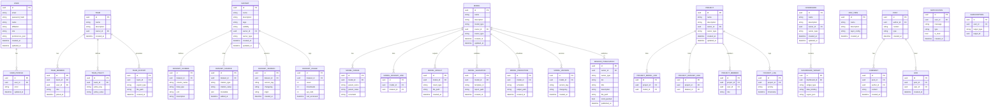

```mermaid
erDiagram

  %% --- User & Profile ---
  USER ||--o{ USER_PROFILE : has
  USER {
    uuid id PK
    string email
    string password_hash
    string name
    string affiliation
    string role
    string preferences_json
    datetime created_at
    datetime updated_at
  }
  USER_PROFILE {
    uuid id PK
    uuid user_id FK
    string orcid
    datetime updated_at
  }

  %% --- Team ---
  TEAM ||--o{ TEAM_MEMBER : has
  TEAM ||--o{ TEAM_POLICY : defines
  TEAM ||--o{ TEAM_EXPORT : generates
  TEAM {
    uuid id PK
    string name
    string description
    uuid owner_id FK
    datetime created_at
  }
  TEAM_MEMBER {
    uuid id PK
    uuid team_id FK
    uuid user_id FK
    string role
    datetime joined_at
  }
  TEAM_POLICY {
    uuid id PK
    uuid team_id FK
    string policy_key
    string policy_value
  }
  TEAM_EXPORT {
    uuid id PK
    uuid team_id FK
    string export_type
    string file_path
    datetime created_at
  }

  %% --- Dataset ---
  DATASET ||--o{ DATASET_SCHEMA : defines
  DATASET ||--o{ DATASET_SOURCE : cites
  DATASET ||--o{ DATASET_VERSION : versions
  DATASET ||--o{ DATASET_USAGE : logs
  DATASET {
    uuid id PK
    string name
    string description
    string tags
    string visibility
    uuid owner_id FK
    string owner_type
    datetime created_at
    datetime updated_at
  }
  DATASET_SCHEMA {
    uuid id PK
    uuid dataset_id FK
    string column_name
    string data_type
    string unit
    string description
  }
  DATASET_SOURCE {
    uuid id PK
    uuid dataset_id FK
    string citation_type
    string citation_value
    json metadata
    datetime added_at
  }
  DATASET_VERSION {
    uuid id PK
    uuid dataset_id FK
    string version_tag
    string changelog
    string origin
    datetime created_at
  }
  DATASET_USAGE {
    uuid id PK
    uuid dataset_id FK
    int views
    int downloads
    int api_calls
    datetime last_accessed
  }

  %% --- Model ---
  MODEL ||--o{ MODEL_PARAM : has
  MODEL ||--o{ MODEL_DATASET_LINK : links
  MODEL ||--o{ MODEL_RESULT : outputs
  MODEL ||--o{ MODEL_VALIDATION : validates
  MODEL ||--o{ MODEL_PREDICTION : schedules
  MODEL ||--o{ MODEL_VERSION : versions
  MODEL ||--o{ ZENODO_PUBLICATION : publishes
  MODEL {
    uuid id PK
    string name
    string description
    string model_type
    uuid owner_id FK
    string owner_type
    datetime created_at
    datetime updated_at
  }
  MODEL_PARAM {
    uuid id PK
    uuid model_id FK
    string param_name
    string param_value
    string constraint
  }
  MODEL_DATASET_LINK {
    uuid id PK
    uuid model_id FK
    uuid dataset_id FK
  }
  MODEL_RESULT {
    uuid id PK
    uuid model_id FK
    string result_type
    string file_path
    datetime created_at
  }
  MODEL_VALIDATION {
    uuid id PK
    uuid model_id FK
    string template_id
    string report_path
    datetime created_at
  }
  MODEL_PREDICTION {
    uuid id PK
    uuid model_id FK
    string schedule
    string output_path
    datetime created_at
  }
  MODEL_VERSION {
    uuid id PK
    uuid model_id FK
    string version_tag
    string changelog
    datetime created_at
  }

  %% --- Project ---
  PROJECT ||--o{ PROJECT_MODEL_LINK : links
  PROJECT ||--o{ PROJECT_DATASET_LINK : links
  PROJECT ||--o{ PROJECT_MEMBER : members
  PROJECT ||--o{ PROJECT_LOG : logs
  PROJECT {
    uuid id PK
    string name
    string description
    uuid owner_id FK
    string owner_type
    datetime created_at
    datetime updated_at
  }
  PROJECT_MODEL_LINK {
    uuid id PK
    uuid project_id FK
    uuid model_id FK
  }
  PROJECT_DATASET_LINK {
    uuid id PK
    uuid project_id FK
    uuid dataset_id FK
  }
  PROJECT_MEMBER {
    uuid id PK
    uuid project_id FK
    uuid user_id FK
    string role
  }
  PROJECT_LOG {
    uuid id PK
    uuid project_id FK
    string activity
    datetime timestamp
  }

  %% --- Dashboard ---
  DASHBOARD ||--o{ DASHBOARD_WIDGET : contains
  DASHBOARD {
    uuid id PK
    string name
    string description
    uuid owner_id FK
    string owner_type
    datetime created_at
    datetime updated_at
  }
  DASHBOARD_WIDGET {
    uuid id PK
    uuid dashboard_id FK
    string widget_type
    string data_binding
    string layout_json
  }

  %% --- GIS ---
  MAP_VIEW {
    uuid id PK
    string name
    string description
    string layer_config
    datetime created_at
  }

  %% --- Community ---
  POST ||--o{ COMMENT : has
  POST ||--o{ LIKE : liked
  POST {
    uuid id PK
    uuid author_id FK
    string content
    string type
    datetime created_at
  }
  COMMENT {
    uuid id PK
    uuid post_id FK
    uuid author_id FK
    string content
    datetime created_at
  }
  LIKE {
    uuid id PK
    uuid post_id FK
    uuid user_id FK
    datetime created_at
  }

  %% --- Zenodo Publication ---
  ZENODO_PUBLICATION {
    uuid id PK
    uuid owner_id FK
    string owner_type
    string doi
    string title
    string description
    string file_path
    bool orcid_pushed
    datetime published_at
  }

  %% --- Notifications ---
  NOTIFICATION {
    uuid id PK
    uuid user_id FK
    string message
    string type
    bool is_read
    datetime created_at
  }
  SUBSCRIPTION {
    uuid id PK
    uuid user_id FK
    string target_type
    uuid target_id
  }
```
